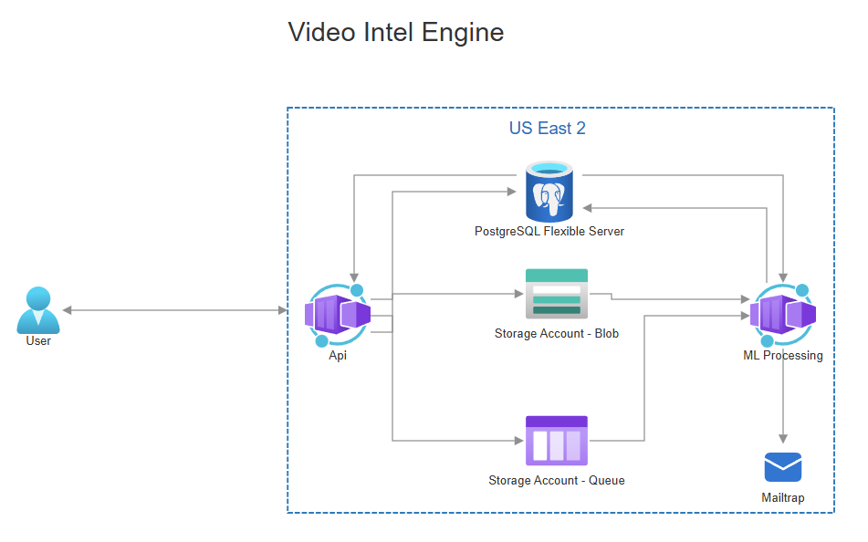

# Video Intel Engine

A demo/portfolio project that accepts video uploads, queues them for background ML processing, and returns a structured threat-analysis report. Built to showcase an event-driven microservice architecture on Azure using Node.js, Python, and Terraform.

---

## What it does

1. A client requests a short-lived access token.
2. The client uploads a video file (or provides a URL).
3. The API stores the video in Azure Blob Storage, creates a processing record, and enqueues a job.
4. The ML processor picks up the job, downloads the video, and runs threat analysis frame by frame.
5. Results are persisted to the database and an email notification is sent.

<br><br>



<br><br>

---

## Stack

| Layer | Technology |
|---|---|
| API | Node.js · Express · TypeScript · Prisma ORM |
| Auth | JWT (short-lived access tokens) |
| ML Processor | Python · YOLOv8s (detection + ByteTrack) · YOLOv8s-pose · OpenCV · Loguru |
| Queue | Azure Storage Queue |
| Blob storage | Azure Blob Storage (SAS URLs for private access) |
| Database | PostgreSQL (Prisma schema) |
| Email | Mailtrap |
| Infrastructure | Azure Container Apps · Azure Container Registry · Terraform |
| Local dev | Docker Compose · Azurite (Azure storage emulator) |

---

## API

All routes are prefixed with `/api`.

| Method | Route | Auth | Description |
|---|---|---|---|
| POST | `/request-access-token` | — | Issue a JWT access token |
| POST | `/process-video` | Bearer token | Upload a video file or submit a URL for processing |
| POST | `/internal/send-email` | Service secret | Trigger result notification email (called by processor) |

---

## ML Analysis

The processor runs two YOLOv8s inference passes per sampled frame:

- **Detection + tracking** — identifies persons and weapons (knife, scissors, baseball bat, bottle, sports ball) with ByteTrack IDs across frames
- **Pose estimation** — detects aggressive body postures (raised arms, fallen persons) via keypoint analysis

Events fired from each frame:

| Event | Trigger |
|---|---|
| `possible_threat` | Weapon + person in same frame |
| `possible_violence` | High motion + persons in close proximity |
| `close_confrontation` | Two persons within distance threshold |
| `crowd_tension` | 4+ persons detected |
| `aggressive_motion` | Frame-to-frame motion score exceeds threshold |
| `aggressive_pose` | Person keypoints indicate aggressive posture |
| `trajectory_following` | Tracked person consistently closing distance on another |

The result payload:

```json
{
  "threat": {
    "events": [
      { "event": "possible_threat", "timestamp": 4.5, "confidence": 0.7 }
    ],
    "summary": {
      "total_events": 3,
      "risk_score": 0.75,
      "risk_level": "high",
      "breakdown": { "possible_threat": 2, "aggressive_pose": 1 }
    }
  }
}
```

Timestamps are in **seconds** from the start of the video.

---

## Local development

### Prerequisites

- Docker Desktop

### Run

```bash
docker-compose up --build
```

This starts:
- `video-intel-api` on `http://localhost:8080`
- `video-intel-processor` in loop mode (polls Azurite queue)
- `postgres` on `localhost:5432`
- `azurite` (Azure storage emulator) on ports `10000` and `10001`

On first run, initialize the database schema:

```bash
cd api
npx prisma db push
```

### Logs

- API: `./logs/api/api.log`
- Processor: `./logs/processor/processor.log`

### Test the flow

```bash
# 1. Get an access token
curl -X POST http://localhost:8080/api/request-access-token \
  -H "Content-Type: application/json" \
  -d '{"email": "test@example.com"}'

# 2. Upload a video
curl -X POST http://localhost:8080/api/process-video \
  -H "Authorization: Bearer <token>" \
  -F "file=@/path/to/video.mp4"
```

---

## Cloud deployment

See [infra/DEPLOY.md](infra/DEPLOY.md) for the full Terraform-based deployment guide.
